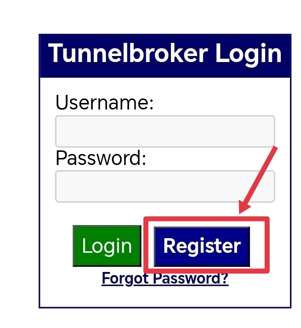
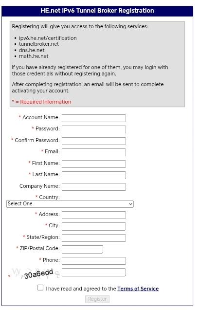
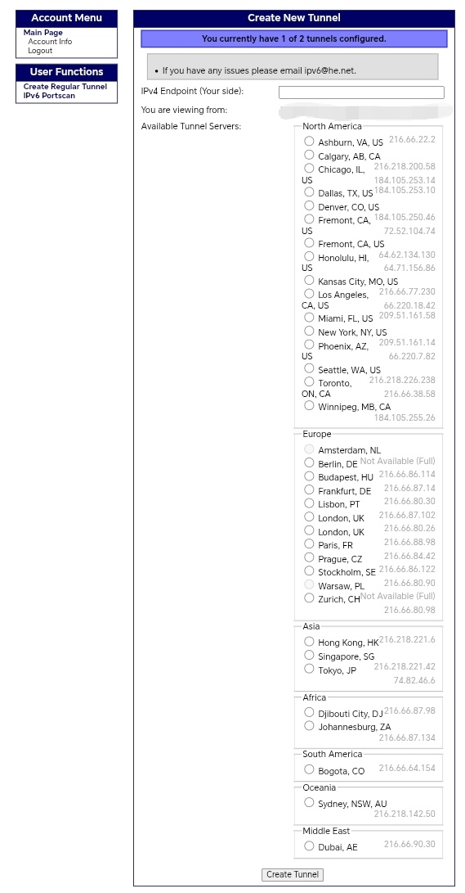

# 前言
前几天心血来潮想去整一点稀有的IP，打开b站一搜索，发现了这个视频。

<iframe width="100%" height="468" src="//player.bilibili.com/player.html?bvid=BV1eK3uz8ECq" scrolling="no" border="0" frameborder="no" framespacing="0" allowfullscreen="true"> </iframe>

# 用tunnelbroker和warp获得全世界大部分ip

### 你需要

- 一个vps
- 域名邮箱（用来注册tunnelbroker）

### 首先先注册tunnelbroker
[tunnelbroker网址](https://tunnelbroker.net/)

点左侧的Register

填写

Account Name是账户名，用来登录的。Email要填域名邮箱（免费邮箱好像不能注册tunnelbroker）你想要哪的IP就选哪个国家

### 创建隧道

点Create Regular Tunnel，IPv4 Endpoint填写VPS的IPV4地址，VPS的IPV4地址要能ping通，Available Tunnel Servers选一个离VPS近的节点，最后点Create Tunnel创建隧道。

### IP分配
Tunnelbroker会分配一个IPV6地址给我们，如果想要更多IPV6地址可以等注册账号的第二天分配48段。

### IP所属地修正
分配到IP后IP的所属地应该是别的国家，所以要提交IP地址修正。[ipinfo.io修正](https://ipinfo.io/corrections)
[Maxmind修正](https://www.maxmind.com/en/geoip-location-correction)还有很多数据库,也可以不提交定位修正。等到两周到一个月,也可能会修改。

### 安装面板
这里使用的是3x-ui面板[github链接](https://github.com/MHSanaei/3x-ui)
安装好后，按照终端输出的链接和用户名登录，修改用户名和密码，配置入站链接，出战链接选warp,确定后再次编辑，域策略改成ForcelIpv6Ipv4,添加入站规则,Inbound Tags选刚刚入站规则的端口，Outbound Tag选择warp。

